# Jetpack Compose Projects

Android 앱 개발 학습 과정에서 Jetpack Compose를 활용한 프로젝트 모음입니다.

---

## 목차

- [MyApp - QuizApp](#MyApp---TOEIC-영단어-학습-앱)
- [Week 3 - Gemini Home Screen](#week-3---gemini-home-screen)
- [Week 4 - Profile & Message Cards](#week-4---profile--message-cards)
- [Week 5 - Counter & Stopwatch](#week-5---counter--stopwatch)
- [Week 6 - Bubble Game](#week-6---bubble-game)

---

# MyApp - TOEIC 영단어 학습 앱

> 게임화된 학습 경험과 20개 카테고리별 체계적 TOEIC 학습

---

## 프로젝트 개요

TOEIC 시험 대비를 위한 영단어 학습 앱으로, **게임화 시스템(레벨/XP/스트릭)**, **20개 TOEIC 도메인 카테고리**, **다양한 학습 모드**를 제공합니다.

- 정답/오답 실시간 통계
- 20개 TOEIC 도메인별 집중 학습
- 스트릭 시스템으로 학습 습관 형성
- 레벨/XP/배지 시스템

---

## 스크린샷

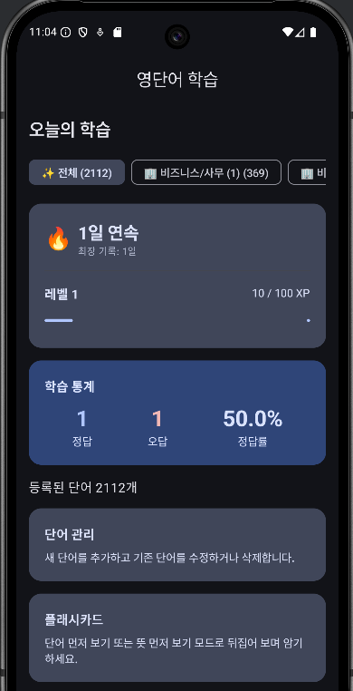
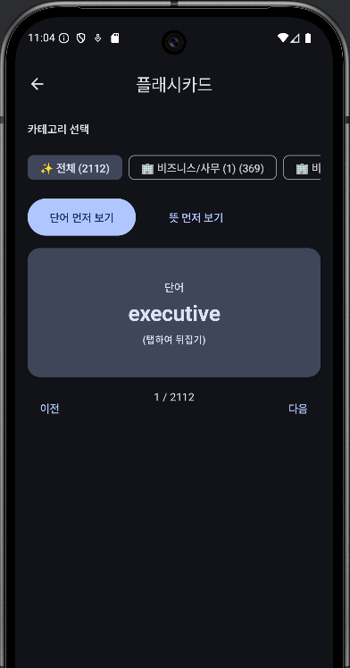
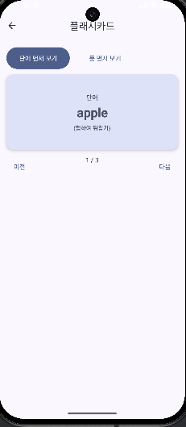
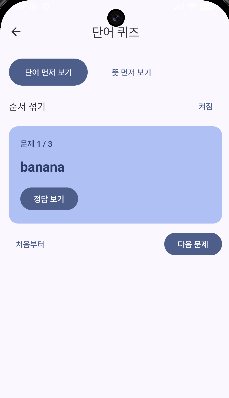

---

## 주요 기능

### 1. 홈 대시보드
- 학습 통계 (정답률, 정답/오답 수)
- 레벨/XP 프로그레스 바
- 스트릭 추적 (현재/최장 기록)
- 20개 TOEIC 카테고리 필터

### 2. 단어 관리
- 단어 추가/수정/삭제
- 키워드 기반 자동 카테고리 분류
- 단어/뜻 실시간 검색

### 3. 플래시카드
- 카드 뒤집기 애니메이션 (180도 회전)
- 단어 먼저 보기 / 뜻 먼저 보기 모드
- 이전/다음 순환 네비게이션

### 4. 단어 퀴즈
- 단어/뜻 먼저 보기 모드
- 셔플 모드, 카테고리별 퀴즈
- 단어별 정답률 추적, 정답 시 +10 XP

### 5. 타이핑 게임
- 60초 타임 어택
- 시간 보너스 점수 시스템
- 정답마다 +15 XP

### 6. 업적 & 뱃지
- 12가지 뱃지 (단어 수집, 퀴즈 완료, 스트릭, 레벨 달성 등)
- 조건 달성 시 자동 해금

---

## 20개 TOEIC 도메인 카테고리

TOEIC 주요 주제를 20개 카테고리로 세분화:

비즈니스/사무 (5개 그룹) | 회계/금융 | 인사/채용 | 영업/마케팅
스케줄/시간관리 | 품질/검사 | 비즈니스 협상 | 운영/생산/물류
기술/IT | 출장/여행 | 숙박/외식 | 법무/규제
건강/의료 | 교육/연수 | 환경/에너지 | 부동산/시설

**자동 분류**: 단어 추가 시 키워드 기반 자동 카테고리 분류 (150+ 키워드 규칙)

---

## 앱 개발 단계

**Phase 1 (MVP)**: 단어 CRUD, 플래시카드, 퀴즈, DataStore 연동
**Phase 2**: 20개 TOEIC 카테고리 시스템 + 자동 분류
**Phase 3**: 레벨/XP/스트릭 게임화 시스템
**Phase 4**: 타이핑 게임, 배지 시스템 (12가지)
**Phase 5**: Material3 디자인, 애니메이션, 검색 기능

---

## 기술 스택

**핵심**: Jetpack Compose, Kotlin, Material3 (minSdk 31)

**주요 라이브러리**:
- `navigation-compose:2.7.7` - 화면 네비게이션
- `datastore-preferences:1.1.1` - 로컬 데이터 저장
- `kotlinx-serialization` - JSON 직렬화

**아키텍처**: MVVM, Repository 패턴, 단방향 데이터 흐름

---

## 데이터 모델

```kotlin
data class WordEntry(
    val id: Long,
    val term: String,              // 영어 단어
    val meaning: String,           // 뜻
    val correctCount: Int = 0,     // 정답 횟수
    val incorrectCount: Int = 0,   // 오답 횟수
    val categoryId: String         // 카테고리 ID
)

data class UserProgress(
    val level: Int = 1,
    val currentXP: Int = 0,
    val currentStreak: Int = 0,
    val longestStreak: Int = 0,
    val unlockedBadges: List<String> = emptyList()
)
```

**저장 방식**: DataStore (Preferences) - JSON 직렬화

---

## 게임화 시스템

**레벨 & XP**
- 퀴즈 정답: +10 XP
- 타이핑 게임 정답: +15 XP
- 레벨업 공식: `다음 레벨 필요 XP = 현재 레벨 × 100`

**스트릭**
- 연속 학습일 자동 추적
- 하루 놓치면 1일로 리셋
- 최장 기록 별도 보관

**정답률**: `(정답 횟수 / 총 시도) × 100`

---

## UI/UX

- **Material3 Design**: Dynamic Color, Card, FilterChip
- **애니메이션**: 플래시카드 180도 회전 (FastOutSlowInEasing)
- **반응형**: 스크롤 가능한 필터, 자동 줄바꿈

---

## 주요 학습 내용

- Navigation Compose, 복잡한 상태 관리 (rememberSaveable)
- DataStore + JSON 직렬화, Flow 기반 반응형 데이터
- Material3 디자인 시스템, 애니메이션 (animateFloatAsState)
- 키워드 기반 자동 분류 알고리즘, 레벨/XP/스트릭 로직
- MVVM + Repository 패턴

---

## Week 3 - Gemini Home Screen

### 프로젝트 개요

외부 링크를 연결하고 이미지를 표시하는 기본적인 홈 화면 구현 학습 프로젝트입니다.

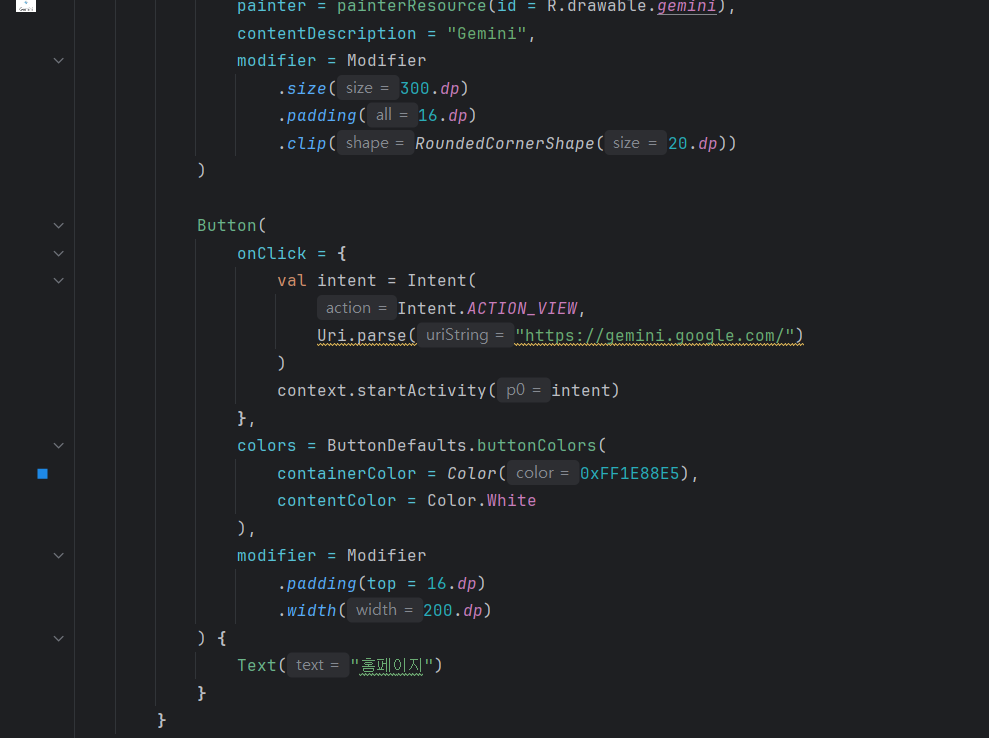
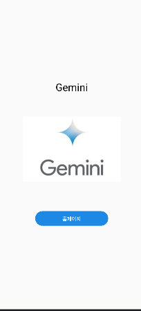

### 기존 코드

- 단일 화면(`HomeScreen`)에서 제목(Text), 이미지(`R.drawable.gemini`), 링크 버튼 구성
- 버튼 클릭 시 `Intent.ACTION_VIEW`로 `https://gemini.google.com/` 열기
- `ComposeLabTheme` 적용, `@Preview` 제공

### 개선 사항

- 레이아웃 정렬 및 여백 정리: `padding(16.dp)`, 중앙 정렬
- 카드 모양 느낌을 위한 이미지 라운딩(`RoundedCornerShape(20.dp)`)
- 버튼 가시성 향상을 위한 컬러 세팅(`containerColor`, `contentColor`)
- `enableEdgeToEdge()` 제거로 기본 안전 영역 유지

### 사용 방법

1. `R.drawable.gemini` 이미지 리소스를 프로젝트에 추가
2. 앱 실행 후 버튼을 눌러 외부 브라우저에서 Gemini 홈페이지 오픈

### 주요 학습 내용

- Intent를 활용한 외부 앱 연동
- 이미지 리소스 처리 및 스타일링
- 기본 레이아웃 구성 및 정렬

---

## Week 4 - Profile & Message Cards

### 프로젝트 개요

Material3 Card 컴포넌트를 활용한 프로필 및 메시지 카드 UI 구현 프로젝트입니다.

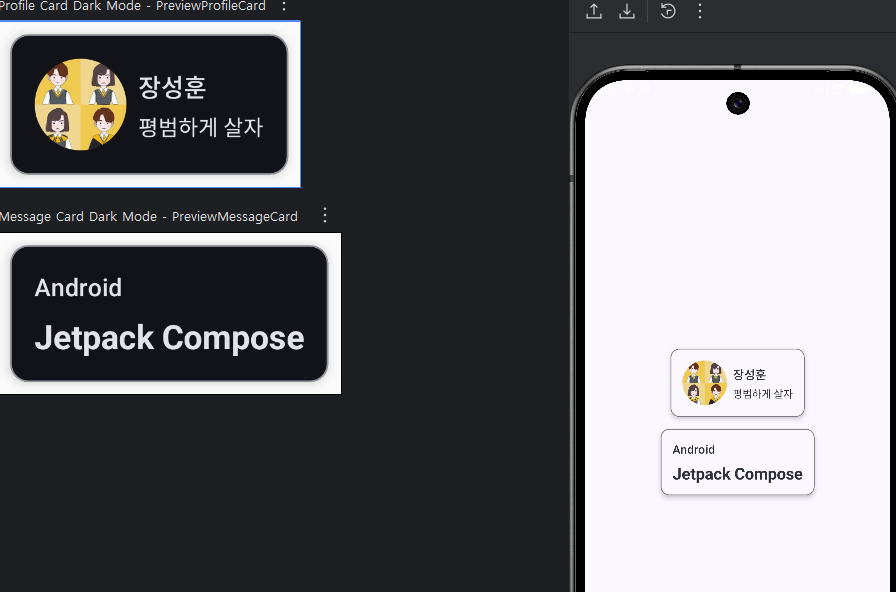
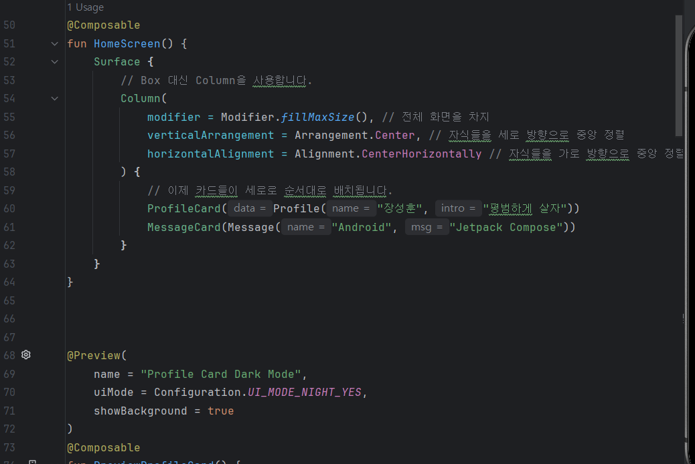

### 기존 코드

- 단일 화면(`HomeScreen`)에서 `ProfileCard`, `MessageCard` 두 컴포저블 표시
- `data class`(Profile, Message)로 UI 데이터 분리
- 이미지 리소스(`R.drawable.profile_picture`) 원형 클리핑 후 표시
- 기본 배치: `Column` 중앙 정렬, `Row` 내부 텍스트 배치
- 다크 모드 프리뷰 제공(`@Preview(... uiMode = UI_MODE_NIGHT_YES)`)

### 개선 사항

- Material3 `Card` 적용: `CardDefaults.cardColors`, `cardElevation`, `BorderStroke`로 카드 스타일 통일
- 색상 체계 정리: `onBackground` 대신 `onSurface` 사용으로 가독성 향상
- 간격/타이포 정리: `titleMedium`, `titleLarge`, `bodyMedium` 및 `Spacer`로 여백 표준화
- 레이아웃 단순화: `Box` → `Column` 전환으로 중앙 정렬 의도 명확화
- 컴포저블 분리 유지: `ProfileCard`, `MessageCard` 각각의 책임 명확

### 사용 방법

1. `R.drawable/profile_picture` 이미지를 프로젝트에 추가
2. 앱 실행 시 `HomeScreen()`에서 `ProfileCard`, `MessageCard`가 중앙 정렬로 표시

### 주요 학습 내용

- Material3 Card 컴포넌트 활용
- Data class를 활용한 UI 데이터 관리
- 컴포저블 함수 분리 및 재사용성
- 타이포그래피 및 색상 시스템

---

## Week 5 - Counter & Stopwatch

### 프로젝트 개요

기본적인 상태 관리와 타이머 기능을 학습하기 위한 카운터 및 스톱워치 앱입니다.

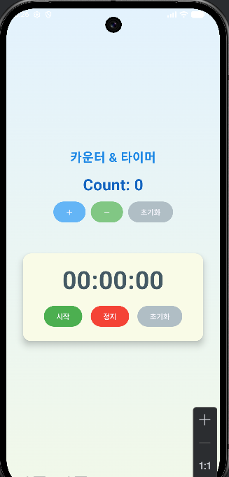
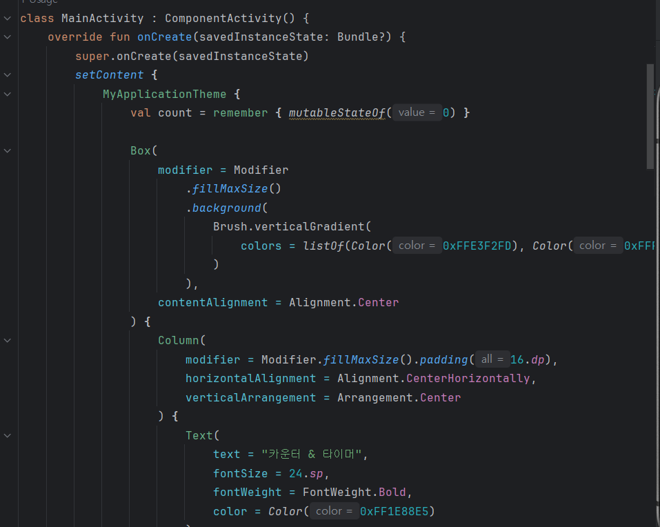

### 기존 코드

- Jetpack Compose 기본 예제 형태
- 카운터 증가 / 리셋 버튼 구현
- 단순한 `while(true)` 루프 기반 스톱워치
- 상태 관리: `mutableStateOf`, `remember` 사용

### 개선 사항

- **Material3 UI** 적용 (Card, RoundedCornerShape 등)
- **LaunchedEffect** 기반 조건부 타이머 실행
- `formatTime()` 함수로 시간 계산 로직 분리
- **Button** 배치 및 정렬 개선으로 직관성 향상
- 코드 구조 단순화 및 UI 일관성 확보

### 주요 학습 내용

- Compose 상태 관리 (`remember`, `mutableStateOf`)
- Side Effect 처리 (`LaunchedEffect`)
- Material3 디자인 시스템 적용
- 시간 포맷팅 및 타이머 구현

---

## Week 6 - Bubble Game

### 프로젝트 개요

물리 효과와 애니메이션을 적용한 인터랙티브 버블 게임입니다.

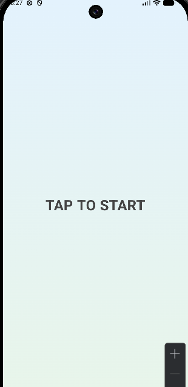
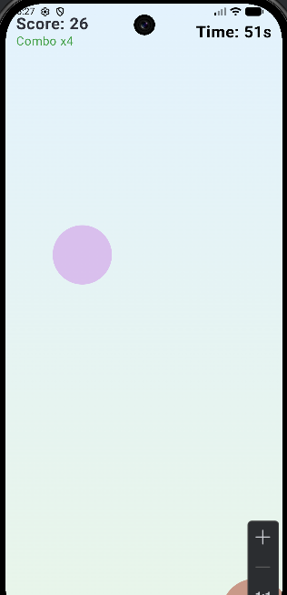
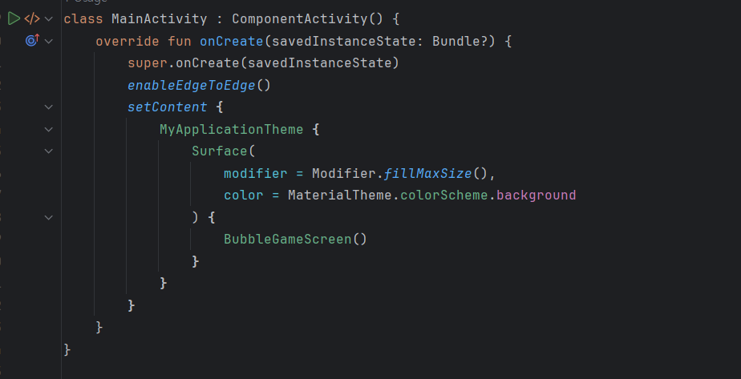

### 기존 코드

- 랜덤 버블 생성 및 단순 이동
- 클릭 시 점수 +1
- 60초 타이머 종료 후 게임 종료
- 물리 효과나 애니메이션 없음

### 개선 사항

- **물리 반동 및 중력 시스템** 추가 → 버블의 움직임이 자연스러움
- **터치 시 폭발 이펙트** 및 입자 표현 추가
- **GamePhase(START / PLAYING / GAMEOVER)** 도입으로 게임 루프 구조화
- **Restart 기능** 추가로 반복 플레이 가능
- 콤보 점수 및 터치 피드백 강화로 인터랙션 향상

### 주요 학습 내용

- Canvas를 이용한 커스텀 드로잉
- 물리 시뮬레이션 구현 (중력, 충돌 감지)
- 게임 상태 관리 및 페이즈 전환
- 애니메이션 및 사용자 인터랙션 처리

---

## 라이선스

이 프로젝트는 학습 목적으로 작성되었습니다.

---

## 작성자

학습 과정에서 작성한 프로젝트입니다.